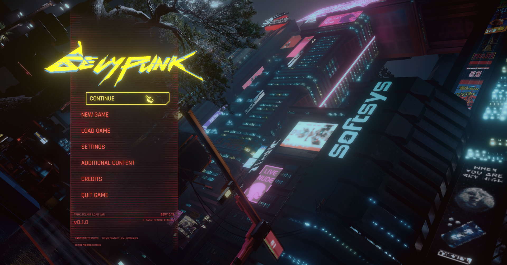

# Bevypunk

This repo is a recreation of ***Cyberpunk*** UI in ***Bevy*** using **[Bevy-Lunex](https://github.com/bytestring-net/bevy_lunex)** crate.

This project serves as advanced example on Bevy and Lunex workflow.

***[You can try it here! (github pages)](https://idedary.github.io/Bevypunk/)***

#

https://github.com/IDEDARY/Bevypunk/assets/49441831/f417d411-63ff-46c1-a0e0-74233b73e7ca

## Credits

Assets used:
 * Logo svg : [Nicola Papale](https://github.com/nicopap)
 * Images   : Recreated by [1D3D4RY](https://github.com/IDEDARY) in Krita and Aseprite + screenshot from game as background
 * Fonts    : [Rajdhani](https://fonts.google.com/specimen/Rajdhani) - provided by *Google Fonts*
 * Music    : [AffectEffect - V Theme cover on Youtube](https://youtu.be/t4XllslwbYc?si=yOS-MXzFvecrIgNc)

 * Male1: [SketchFab](https://sketchfab.com/3d-models/full-body-cyberpunk-male-65c441d2146c49a1af115bceb1588727) - CC Attribution-NonCommercial-ShareAlike
 * Male2: [SketchFab](https://sketchfab.com/3d-models/ready-player-me-male-avatar-ca294f737d0b4293bb29bfcd8a0a27dd) - CC Attribution-NonCommercial-ShareAlike
 * Male3: [SketchFab](https://sketchfab.com/3d-models/readyplayerme-cyberpunk-5881c7e4431d44058325b4be4d8d30dc) - CC Attribution-NonCommercial-ShareAlike
 * Female1: [SketchFab](https://sketchfab.com/3d-models/female-full-body-cyberpunk-themed-avatar-7a8fa15955084fa3bf7103ed1818c584) - CC Attribution-NonCommercial-ShareAlike
 * Female2: [SketchFab](https://sketchfab.com/3d-models/readyplayerme-cyberpunk-bc1e5da743a24625a554f7293fe7a323) - CC Attribution-NonCommercial-ShareAlike
 * Female3: [SketchFab](https://sketchfab.com/3d-models/readyplayerme-cyberpunk-f8dc753a6dc1482590c1bc993b41c42e) - CC Attribution-NonCommercial-ShareAlike
 * Female4: [SketchFab](https://sketchfab.com/3d-models/full-body-cyberpunk-girl-ed3138dab70f4808af8b68a55aaa0c8b) - CC Attribution-NonCommercial-ShareAlike

## Contributing

Any contribution submitted by you will be dual licensed as mentioned below, without any additional terms or conditions. If you have the need to discuss this, please contact me.

## Licensing

The **CODE** is released under both [APACHE](./LICENSE-APACHE) and [MIT](./LICENSE-MIT) licenses. Pick one that suits you the most!

> [!CAUTION]
> **THE ASSETS ARE NOT INCLUDED!**
